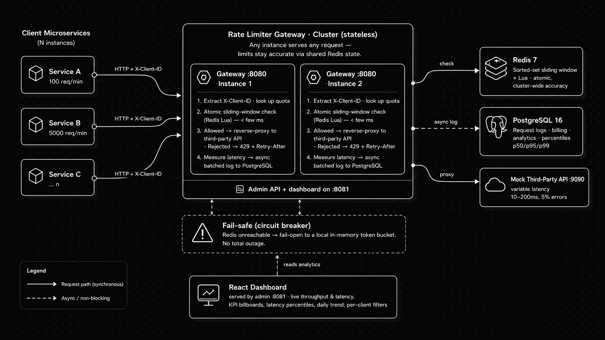
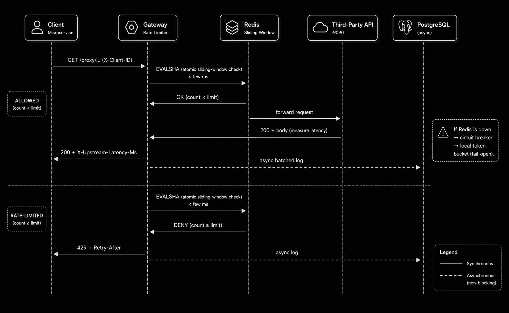

# Global Rate Limiter as a Service

A **High-Availability** distributed rate-limiting gateway built in **Go**, backed
by **Redis 7** for atomic request counting and **PostgreSQL 16** for analytics and
billing logs, with a **React** real-time observability dashboard styled after
New Relic.

Built as a technical assessment for vegaIT — see [`inst.txt`](./inst.txt) for the brief.

---

## Architecture



### Request flow (sequence)



*(The prompt used to generate these diagrams lives in
[`docs/GEMINI_ARCHITECTURE_PROMPT.md`](./docs/GEMINI_ARCHITECTURE_PROMPT.md).)*

**Request flow:** a client sends a request to the gateway with an `X-Client-ID`
header → the gateway looks up that client's quota → runs an **atomic sliding-window
check in Redis (Lua)** in a couple of milliseconds → if allowed, it **reverse-proxies**
to the third-party API, measures latency, and **asynchronously batches a log** to
PostgreSQL; if denied, it returns **429 + Retry-After**. If Redis is unavailable,
a **circuit breaker fails open** to a local in-memory token bucket so traffic is
never fully blocked.

---

## Quick Start

### One command

```bash
./run.sh
```

This runs `docker compose up --build`, waits for the gateway to become healthy,
opens the dashboard, and prints every link. Under the hood it starts:

| Service       | Port | Description                          |
|---------------|------|--------------------------------------|
| Rate Limiter  | 8080 | Gateway proxy endpoint               |
| Admin + Dashboard | 8081 | REST API, health checks, and the React dashboard |
| PostgreSQL    | 5432 | Analytics database                   |
| Redis         | 6379 | Rate-limit state store               |
| Mock API      | 9090 | Simulated third-party API            |

Then open **http://localhost:8081** for the dashboard.

> Prefer the raw command? `docker compose up --build` works exactly the same —
> `run.sh` just adds health-waiting and prints the links.

Other `run.sh` subcommands: `./run.sh logs`, `./run.sh down`, `./run.sh restart`.

### See it work

```bash
./demo.sh        # functional walkthrough: rate limiting + per-request latencies
./loadtest.sh    # fire >10,000 requests and watch the dashboard update live
```

---

## The three scripts

| Script | What it does |
|--------|--------------|
| **`./run.sh`** | Builds and starts the whole stack with one command; waits for health; prints/open the dashboard link. |
| **`./demo.sh`** | End-to-end proof: fires 14 requests at `client-alpha` (10/10s) so you watch the first 10 pass and the rest return **429**, shows per-request **latency**, verifies window reset, and prints the analytics summary (incl. latency percentiles). |
| **`./loadtest.sh`** | Runs the Go load generator: **>10k concurrent requests** with a live progress bar and a minimalist, New Relic-style terminal report (throughput + latency **p50/p90/p95/p99**). Runs locally if Go is installed, otherwise inside the container. |

Load generator flags (pass through `loadtest.sh`):

```bash
./loadtest.sh -n 50000 -c 300              # 50k requests, 300 workers
./loadtest.sh -client client-beta          # target a different client
```

---

## The Dashboard

A minimalist, New Relic-style observability UI served at **http://localhost:8081**:

- **KPI billboards** — total throughput, success rate, rate-limited count, and the
  full latency spread (**avg, p50, p95, p99**).
- **Live view** — per-minute **throughput** (allowed vs rate-limited) and
  **latency** (avg vs p95) charts that update every ~3 seconds. Run `./loadtest.sh`
  and watch them fill in real time.
- **Daily trend** — allowed vs rate-limited over the last 10 / 15 / 30 days.
- **Per-client filters**, pipeline health, and fail-safe status.

Chart colors are colorblind-safe (validated: allowed/blocked ΔE 26.8, avg/p95
ΔE 15.9), one y-axis per chart, identity by legend + label (never color alone).

---

## How It Works

### Sending requests through the gateway

```bash
# Proxy a request (defaults to the mock API when no X-Target-URL is given)
curl -H "X-Client-ID: client-alpha" http://localhost:8080/proxy/test

# Target an explicit upstream
curl -H "X-Client-ID: client-alpha" \
     -H "X-Target-URL: http://mock-api:9090/some-endpoint" \
     http://localhost:8080/proxy/test

# Allowed (200): proxied body + X-Upstream-Latency-Ms header
# Rate-limited (429): { "error": "rate limit exceeded", ... } + Retry-After
```

### Pre-configured clients

| Client ID     | Rate Limit    | Window |
|---------------|---------------|--------|
| client-alpha  | 10 requests   | 10 sec |
| client-beta   | 100 requests  | 60 sec |
| client-gamma  | 5000 requests | 60 sec |

### Admin / Analytics API (port 8081)

```bash
curl http://localhost:8081/health                 # liveness
curl http://localhost:8081/health/deep            # checks Redis + PostgreSQL
curl http://localhost:8081/api/clients            # list clients
curl "http://localhost:8081/api/analytics/summary?days=30"   # totals + p50/p95/p99
curl "http://localhost:8081/api/analytics/trend?days=15"     # daily buckets
curl "http://localhost:8081/api/analytics/live?minutes=15"   # per-minute live buckets
curl http://localhost:8081/api/logger/stats       # async pipeline metrics

# Create/update a client
curl -X POST http://localhost:8081/api/clients/upsert \
  -H "Content-Type: application/json" \
  -d '{"client_id": "new-client", "rate_limit": 200, "window_seconds": 60}'
```

---

## Running Tests

### Unit & race-condition tests (need Redis)

```bash
docker compose up -d redis postgres

cd backend
go test -v -race ./tests/...        # includes concurrency/race tests
go test -v -short ./tests/...       # skips time-dependent tests
```

### Load & performance tests (need the full stack)

```bash
docker compose up --build -d

cd backend
go test -v -run TestLoad_Throughput   -count=1 ./tests/...
go test -v -run TestLoad_BurstRecovery -count=1 ./tests/...
go test -bench=BenchmarkRateLimitCheck -benchtime=5s ./tests/...
```

Or use the standalone generator for a bigger, prettier run: **`./loadtest.sh`**.

---

## Verifying Edge Cases

### 1. Rate limiting is accurate

```bash
./demo.sh
# client-alpha (10/10s): first 10 → 200, next 4 → 429, then resets after the window.
```

### 2. Redis failover (fail-safe)

```bash
docker compose stop redis
curl -H "X-Client-ID: client-alpha" http://localhost:8080/proxy/test   # still 200 (fail-open)
curl http://localhost:8081/health/deep                                 # "degraded"
docker compose start redis                                             # auto-recovers in ~5s
```

### 3. Concurrent race conditions

```bash
cd backend && go test -v -race -run TestRaceCondition -count=1 ./tests/...
```

### 4. Analytics under load

```bash
./loadtest.sh                 # generate >10k requests
# watch the dashboard Live view, or:
curl "http://localhost:8081/api/analytics/summary?client_id=client-gamma&days=1"
```

---

## Project Structure (Monorepo)

```
.
├── run.sh · demo.sh · loadtest.sh    # one-command run, functional demo, load test
├── docker-compose.yml · Dockerfile   # full-stack orchestration (single command)
├── architecture.png · sequence.png   # system + request-flow diagrams
├── docs/GEMINI_ARCHITECTURE_PROMPT.md
├── backend/                          # Go service
│   ├── cmd/server/main.go            # gateway + admin entrypoint
│   ├── cmd/loadgen/main.go           # >10k load generator (New Relic-style report)
│   ├── internal/
│   │   ├── config/     · centralized env-var config
│   │   ├── database/   · Postgres + Redis, migrations, analytics queries (percentiles)
│   │   ├── limiter/    · Redis Lua sliding window + local failover
│   │   ├── logger/     · async batched logging pipeline
│   │   ├── middleware/ · CORS, recovery, access log, request ID, client ID
│   │   ├── handlers/   · admin/dashboard REST API
│   │   ├── proxy/      · reverse-proxy gateway handler
│   │   └── httputil/   · shared response helpers
│   └── tests/          · unit, race, and load/performance tests
├── dashboard/                        # React (Vite + Recharts) observability UI
│   └── src/ (App, theme, api, hooks, components/…)
└── mock-api/                         # simulated third-party API
```

---

## Design Decisions

| Decision | Rationale |
|---------|-----------|
| **Sliding-window counter** (not fixed window) | Prevents burst-at-boundary attacks where a fixed window allows 2× the limit around resets. |
| **Redis Lua scripts** | Atomic check-and-increment — no race conditions regardless of how many gateway instances run. |
| **Circuit breaker + local fallback** | If Redis fails, fail *open* with a local token bucket instead of blocking all traffic. |
| **Async buffered logging** | Writing to PostgreSQL on the hot path would add 5–20ms; buffering through Go channels keeps the rate-limit check at <2ms. |
| **Reverse-proxy gateway** | Captures upstream latency and status automatically — clients don't have to report anything. |
| **Latency stats over *allowed* requests only** | 429s never hit the upstream (0ms); including them would deflate the percentiles. |
| **Separate gateway (8080) & admin (8081) ports** | The admin API can be firewalled independently of the public proxy. |
| **Go `internal/` packages** | Compiler-enforced encapsulation of implementation details. |

---

## License

Built as a technical assessment solution for VegaIT by Toheeb Ogunade.
Repository: ['rate-limiter'](https://github.com/qeinstein/vegait)